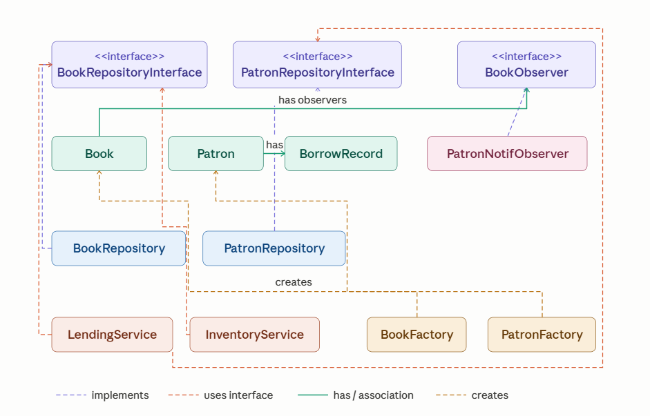

# Library Management System

A Library Management System built in Java demonstrating Object-Oriented Programming, SOLID principles, and design patterns.

---

## How to Run

1. Clone the repository
2. Open the project in IntelliJ IDEA
3. Add the SLF4J JAR files from the `libs/` folder to the project libraries
    - File → Project Structure → Libraries → + → Java → select both JARs
4. Run `com.library.Main`

---

## Project Structure

src/
└── com/library/
├── model/          → Book, Patron, BorrowRecord
├── repository/     → BookRepository, PatronRepository + interfaces
├── service/        → LendingService, InventoryService
├── factory/        → BookFactory, PatronFactory
├── observer/       → BookObserver interface, PatronNotificationObserver
└── util/           → reserved for future helpers (e.g. date formatters, validators)

---

## Features

- Add, remove, and update books in the inventory
- Search books by title, author, or ISBN
- Add and update patron information
- Track full borrowing history per patron
- Checkout and return books with validation
- Real-time inventory tracking (available vs borrowed)
- Automatic patron notification when a reserved book becomes available

---

## OOP Concepts Applied

| Concept | Where |
|---|---|
| Encapsulation | All fields in `Book` and `Patron` are private, accessed via getters/setters |
| Abstraction | `LendingService` hides checkout/return complexity behind simple method calls |
| Inheritance | `PatronNotificationObserver` implements `BookObserver` interface |
| Polymorphism | Any class implementing `BookObserver` can be plugged in as a notification handler |

---

## SOLID Principles

| Principle | Application |
|---|---|
| Single Responsibility | Each class has one job — `Book` holds data, `LendingService` handles lending, `InventoryService` handles inventory |
| Open/Closed | New observer types can be added without modifying existing code |
| Liskov Substitution | Any `BookRepositoryInterface` implementation can replace another without breaking services |
| Interface Segregation | `BookRepositoryInterface` and `PatronRepositoryInterface` are separate focused interfaces |
| Dependency Inversion | `LendingService` and `InventoryService` depend on interfaces, not concrete repository classes |

---

## Design Patterns

### Factory Pattern
`BookFactory` and `PatronFactory` centralize object creation with input validation. All book and patron creation goes through the factory — if the constructor ever changes, only the factory needs updating.

### Observer Pattern
`Book` maintains a list of `BookObserver` subscribers. When a book is returned, all subscribed patrons are automatically notified via `onBookAvailable()`. New notification types (email, SMS) can be added without touching existing code.

---

## Tech Stack

- Java (OpenJDK 25)
- IntelliJ IDEA
- SLF4J + SLF4J Simple (logging)

---

## Class Diagram

